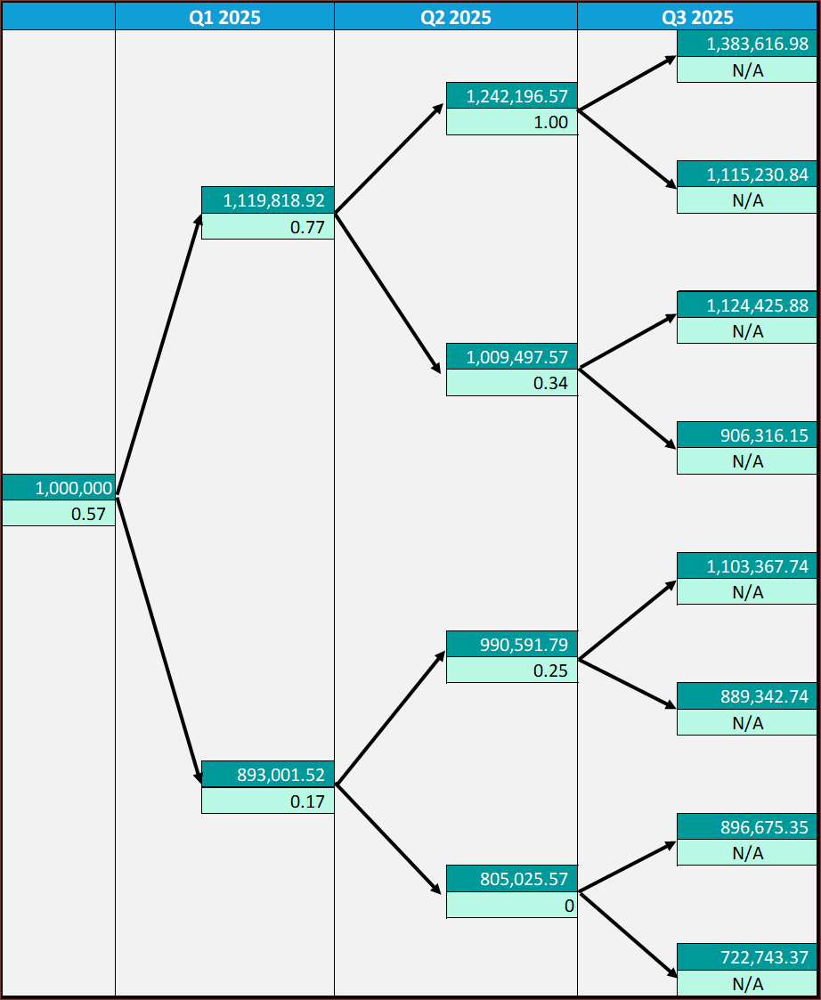
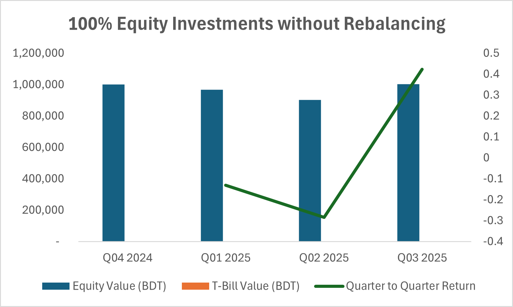
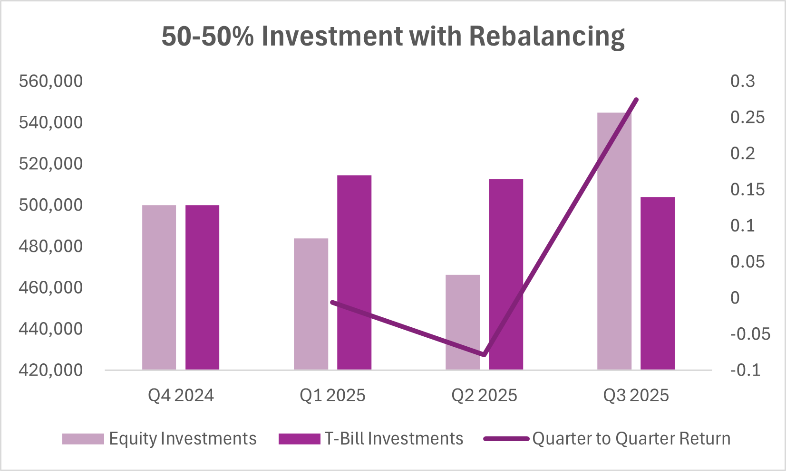
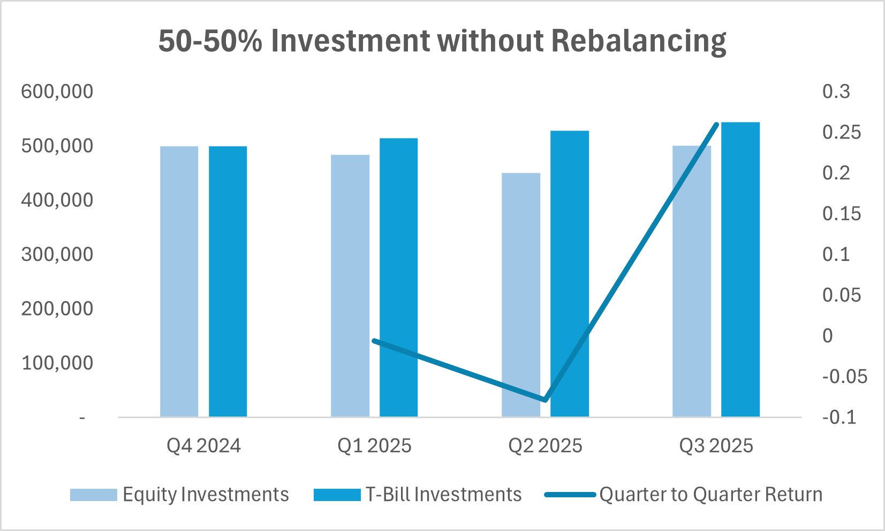
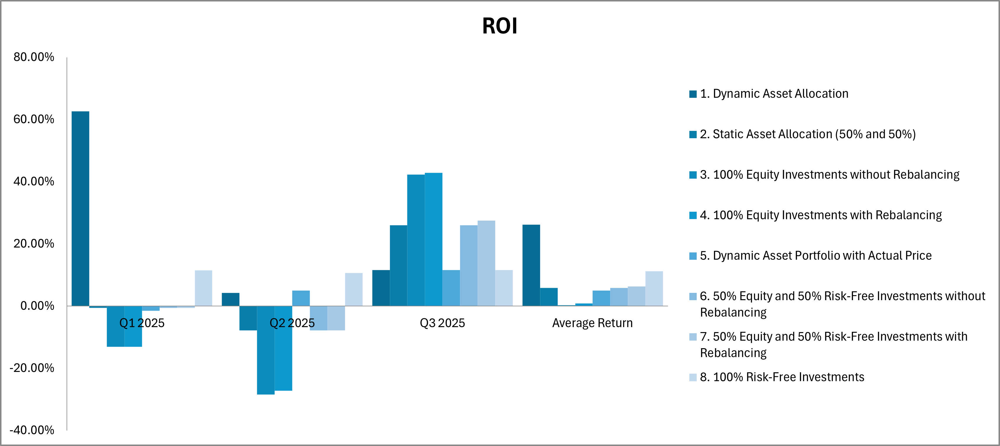

# Dynamic Asset Allocation Strategy – DSE Portfolio

This repository presents an academic implementation of a **Dynamic Asset Allocation (DAA)** model applied to a portfolio of **8 DSE-listed equities** and a **91-day Bangladesh Government Treasury Bill**.  
The project is developed as part of the **Financial Derivatives (F-503)** course at the University of Dhaka.

---

## 📘 Overview
The study evaluates the performance of a dynamically managed portfolio that adjusts exposure to risky and risk-free assets based on market volatility and option-based portfolio insurance techniques.

### Key Features
- Construction of an **8-stock DSE portfolio** (UCB, IDLC, GP, BATASHOE, RENATA, WALTONHIL, RAKC, OLYMPIC)
- Integration of **91-day Treasury Bill yield** as a risk-free component
- Application of **binomial tree modeling** for dynamic allocation
- Implementation of **put/call option dynamics and delta hedging**
- Comparison with:
  - 100% Equity (with/without rebalancing)
  - 100% Risk-Free
  - 50/50 Equity–T-Bill (with/without rebalancing)

---

## 📊 Methodology
1. Data collected from [DSE](https://www.dse.com.bd) and [Bangladesh Bank](https://www.bb.org.bd)
2. Daily returns computed with dividend and rights adjustments
3. Covariance and rolling volatility estimated
4. Dynamic allocation modeled using option replication principles
5. Results compared across alternative portfolio strategies

---

## 📈 Results Summary
| Strategy | Avg Return | Std. Dev | Return/Risk |
|-----------|-------------|-----------|--------------|
| Dynamic Asset Allocation | **26.13%** | 25.94% | 1.01 |
| 100% Equity (Rebalanced) | -2.02% | 22.56% | -0.09 |
| 50/50 Equity–Tbill | -0.36% | 11.38% | -0.03 |
| 100% T-bill | 1.09% | 0.44% | 2.46 |

> In general, the DAA strategy was more efficient than both other strategies during most periods, which proves its ability to adapt to market changes. The report concludes that dynamic asset allocation, with derivative-based insurance and periodic rebalancing, optimises portfolio efficiency, giving an investor a better, risk-adjusted return model in turbulent markets.
---

## 📈 Visual Insights

Below are key visual outputs from the Dynamic Asset Allocation (DAA) analysis.

### 1. Dynamic Portfolio with Actual Price

> This chart shows the DAA strategy following actual market prices Q4 2024–Q3 2025, with the portfolio split between equity and T-bill positions dynamically adjusted based on delta. The steady upward trajectory from BDT 1,000,000 to BDT 1,098,912 and consistent positive returns demonstrate DAA's resilience. The strategy effectively manages downside in Q2 while capturing upside in Q3, delivering superior risk-adjusted performance.

---

### 2. Delta Movement Across Quarters

> Delta rises in bullish markets (indicating higher equity exposure) and falls during bearish phases, shifting funds toward the risk-free asset. The binomial tree visualization shows how the delta (hedge ratio) evolves across quarters starting at 0.57 initially. Delta increased to 0.77 in upward market movements and decreased to 0.17 in downward movements, guiding dynamic rebalancing decisions. This tree demonstrates that delta values change based on portfolio path, requiring active adjustments between equity and T-bill holdings to maintain optimal insurance coverage.

---

### 3. 100% Equity Investment with Rebalancing

> Rebalancing within a 100% equity framework yields marginal improvements, with ending value of BDT 1,006,232 versus BDT 971,437 without rebalancing. Although rebalancing reduces losses slightly (-0.62% return), the all-equity approach remains volatile and underperforms DAA. This illustrates that equity-only rebalancing cannot protect against market downturns as effectively as dynamic hedging with derivatives.

---

### 4. 100% Equity Investment without Rebalancing

> This strategy holds the entire BDT 1 million in equities without adjustments across quarters. The portfolio experiences significant downside with negative returns in Q1-Q2 and ending at BDT 971,437 (−2.86% holding period return). The high volatility illustrated by the sharp drops demonstrates why unmanaged equity portfolios are risky, particularly in emerging markets.

---

### 5. 100% Risk Free Investment

> The 100% T-bill strategy provides steady, consistent quarterly returns shown by the stable green bar and rising return line. With no equity exposure, this conservative approach delivered an 8.79% holding period return and an ending value of BDT 1,087,872. While risk (0.41% standard deviation) is minimal, the growth is also limited compared to strategies incorporating equity exposure.

---

### 6. 50% Equity and 50% T-bill with Rebalancing

> This chart compares the static 50-50 allocation with quarterly rebalancing to maintain the 50-50 split. Rebalancing shows improved performance with an ending value of BDT 1,048,723 versus BDT 991,151 without rebalancing. The return line demonstrates that active rebalancing captures gains from market recoveries while controlling risk, resulting in a 4.87% return versus -0.88% without rebalancing.

---

### 7. 50% Equity and 50% T-bill without Rebalancing

> This chart tracks a static 50-50 equity-T-bill split without quarterly rebalancing over the investment period. The quarter-to-quarter return line shows volatility, with negative returns in Q1 and Q2 but recovery in Q3. Without rebalancing, the equity portion's weight drifts with market movements, resulting in an ending value of BDT 991,151 and a return of -0.88%, highlighting the importance of active portfolio management.

---

### 8. Portfolio Value Comparison

> This bar chart compares final portfolio values across all eight strategies in Q1, Q2, and Q3 2025. DAA consistently ranks highest, reaching BDT 1,216,501 by Q3. Risk-free and balanced strategies show moderate growth, while pure equity strategies lag. The chart visually demonstrates DAA's dominance in generating wealth while managing risk compared to traditional approaches.

---

### 9. Quarter to Quarter Return Comparison

> This table compares quarterly returns across all strategies, showing DAA's average return of 26.13% (though with volatility: 62.58%, 4.26%, 11.56%). Static and equity strategies show lower or negative average returns, while 100% risk-free delivers consistent positive but lower returns (11.23% average). DAA's superior average return reflects its ability to balance protection and growth.

---

### 10. Quarter to Quarter Value Comparison

> This table displays the ending portfolio values for each investment strategy across Q1, Q2, and Q3 2025, plus their average values. Dynamic Asset Allocation achieved the highest ending value of BDT 1,216,501 with an average of BDT 1,189,234. The 100% risk-free strategy maintained steady but lower growth, while equity-heavy strategies showed more volatility and lower overall returns, demonstrating DAA's superior risk-adjusted performance.

---

### 11. Return on Investment

> This grouped bar chart shows quarterly ROI for each strategy, highlighting DAA's exceptional Q1 performance (62.58%) and moderate Q2-Q3 returns (4.26%, 11.56%). Most strategies show negative or minimal Q2 returns, while DAA maintains positive growth. The average ROI of 26.13% for DAA far exceeds alternatives, validating the dynamic hedging approach.

---

### 12. Standard Deviation

> This horizontal bar chart ranks strategies by volatility measured as standard deviation. DAA exhibits moderate risk (approximately 25.94%), lower than pure equity strategies (30%+) but higher than balanced approaches (14%). The 100% risk-free strategy shows minimal risk (0.41%), confirming that DAA achieves a balanced profile: reasonable growth with controlled downside risk, making it an optimal choice for risk-conscious investors.

---

## 💻 Files
- `DAA_Report.pdf` – Full term paper on Dynamic Asset Allocation  
- `excel_model/Dynamic_Asset_Allocation.xlsx` – Excel template implementing DAA, binomial tree, and option dynamics  
- `documentation/` – Contains methodological explanations, strategy comparisons, and supporting notes  
- `data/` – Raw and processed input data  
- `visuals/` – Figures and charts

---

## 🧠 Skills Demonstrated
- Derivatives and Portfolio Theory  
- Option Pricing and Delta Hedging  
- Dynamic Rebalancing  
- Financial Modeling in Excel  
- Empirical Research and Report Writing
